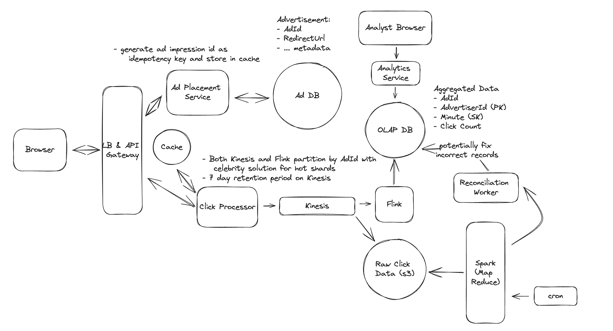

## Main Topics

- Flink
- OLAP DB
- Queue
- Impression Ids
- Reconciliation Worker

## FR

- Click on Ad and be redirected to advertisers website
- Collect Ad click metrics over time - granulairty of 1 min.

## Services

- Click Processor
- Queue
- Flink
- OLAP DB

## Deep Dives

- General Arch:

  - User Redirected using 302 - so has to go through server over
  - Ad Placement Service - Houses Ad DB (AdId, redirectURL)
  - Click Processor Service

- How to Provide Real Time analytics ?

  - Click Processor Service goes to queue
  - Flink/Spark pulls from Queue - helps with real-time aggregation
  - Save data in OLAP DB - to store the aggregation
  - Analytics Service pulls data from it

- Support 10K clicks per second

  - Horizontal scaling, partitioning/sharding based on AdId (Queue)
  - Hot Shards
    - AdId:0-N - number of additional partitions generated

- Ensure we don't lose any click data

  - Above arch already handles this with queue
  - 7 days retention period on queue
  - Reconciliation worker that also re-aggregates async
    - S3 db stores clicks -> Spark datalake fetches the data - triggered through a CRON Job and then Reconciliation worker kicks in and checks for any disparity in OLAP DB

- Abuse from users:

  - impression ID on server side with signature
  - Put a Redis Cache at the Click Processor service if it exist then ignore and not send to queue

- Low Latency:
  - Flink / OLAP DB
  - CRON Job for higher granulairty than 1 minute
