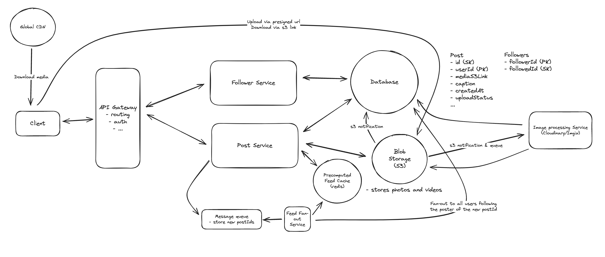

## Main Topics

- Queue
- S3
- precomputation - fanout on write & fanout on read
- GSI

## Functional Requirements

- Users can post pictures/media
- Users can follow other users
- Users can view the people they're following pictures - chronological

## Services

- Post Service (Will act as feed service too, but can separate it out)
- Follower Service
- Feed Fan out service

## Deep Dives

- General Architecture

  - DynamoDB for high R/W with non-relational
  - We will have a follower service that would have all the followers the user follows posted to DB
  - Post service would create posts and then also provide the feed
    - Store media in S3

- Feed Content Low Latency:

  - Similar to FBNewsFeed, we leverage precomputation - Fanout on Write
  - When user posts we fetch all of the followers for this user (Put a GSI on the userId with followerId as a sort key)
    - we store all these jobs for all these users in a queue
  - the feed fanout service then fetches all the followers and then stores the postId for these followers in a Redis Cache
  - We can have a hybrid of 100k+ users we directly fetch on fanout for read
    - go to the DB directly and fetch all of the user and see if they follow a celebrity - if they do then fetch the celebrities post

- Render photos and videos instantly
  - S3 multipart upload - directly to the presignedURL
  - Download using CDN
  - have an image processing service that stores various different formats for a media for different types of images
