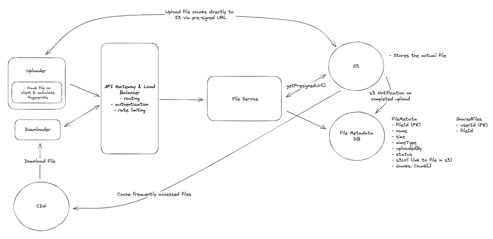

## Main Topics

- S3 - multi-part upload
- Compression
- Encryption - Private and Secret key

## FR

- User should be able to send files
- User should be able to download any files
- User should be able to share files
- Sync files across any device

## Services

- File Service
- S3
- CDN

## Deep Dives

- Basic Arch:

  - File Service - Upload the file directly to blob storage through multi part upload
    - Send s3 notification
    - Give the client the presignedURL
  - Download from CDN - give the user presignedURL
  - Can share with a separate table of userId and fileId
    - as opposed to on the file itself since it makes it difficult to find all the files a given user is accessed to
  - Automatic sharing
    - Local -> Remote - FileSystemWatcher / FSEvents - monitor the dropbox folder for any changes using before
    - Remote -> Local - Polling for inactive files and websockets for files that are fresh -> enables near real time sync

- Resumable uploads:

  - Fingerprint - chunking - multi-part upload

- How can we make upload/download as fast as possible

  - Compression of files -> Compress on client and then decompress on server

- Security
  - Transit - HTTPs (TLS authentication and encryption)
  - Rest - Encrypt the data at Rest - s3 - use private key
  - Access Control -
