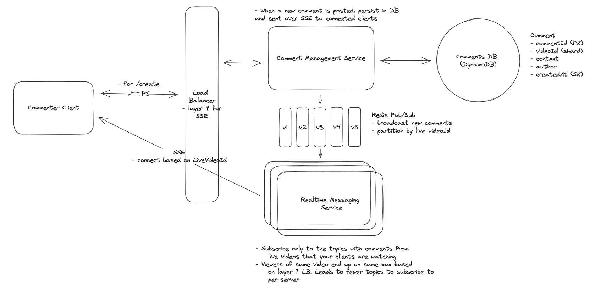

## Main Topics

## FR

- User can add comments
- User can view other users comments in real time
- View comments before they joing the live feed

## Services

- Comment Management Service
- DynamoDB

## Deep Dives

- General Arch:

  - Client sends message -> Comment Management Service receives and sends comments -> Dynamo DB (High Read/Write along w/t non-relational data)

- Viewing comments before joining live feed

  - Cursor Pagination
  - commentId and everything before it is fetched (last 10)

- Comments are broadcasted to viewers in real time

  - SSE - since lower read / write ratio (Higher Read)
  - Creation of comments through regular POST

- Support millions of concurrent viewers
  - SSE - 100k per server connection to be maintained
    - Further Scale onto horizontal machines
    - Comments sent to machine 1 can be received by viewers on machine 1 easily since SSE sends the comments but machine 2 cannot
      - We would need to send the comments to multiple servers
    - Layer 7 LB along with partitioned pub/sub on videoId
      - All users connected to the same server for the videoId so can subscribe to the same topic to receive SSE
