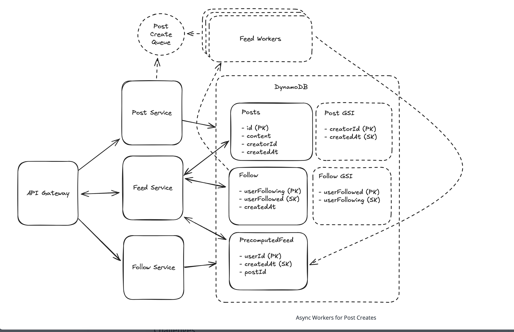

## Main Topics

- Post, Follow, Feed Service
- GIS - global secondary index
- Fanout - precomputed feed
- Updating pre-computed feed with queues and feed workers for non high following users and merging the post feed
- distributed cache between the feed service and posts table

## FR

- User should be to add followers
- User should be able to add posts - and their followers able to see these posts
- User should be able to see their followers posts in chronological order
- Pagination of their feed

## Services

- Post Service
- Follow Service
- Feed Service

## Deep Dives

- User should be able to paginate through their feed

  - the post have a global secondary index -> creatorId as the partition key and createdAt as the sort index

- Users following large number of users

  - We would need to parse through a large set of users and their associated posts
  - Rather on reading the list of posts -> you pre-compute postIds on write for each user in the system
  - So each UserId will have postIds of all its followers attached to it on write

- How do we handle large number of followers:

  - Post Queue with Async Workers
  - On posting a feed to the queue and feed of workers is fetches all the followers of the user and pre-pends the postId to the precomputedFeed above
    - Further we can do this for users that DON'T have large number of followings and our worker can ignore this - then on reading we get all the posts from the pre-computed feed which was leveraged by the async workers BUT we fetch the recent posts from the large following users and merge it

- Uneven reads of posts
  - Have a cache between when fetching the feed and having a TTL and LRU cache evict policy
