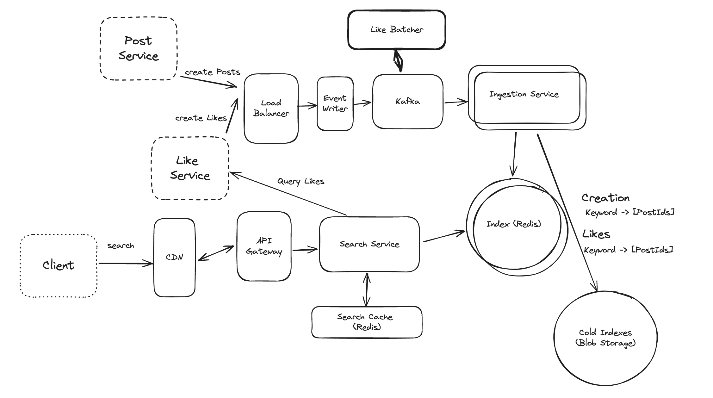

## Main Topics

- Buffer
- Kafka
- dispatcher
- Redis Indexing - Appending, sorted indexing, inverted indexing
  - Multi Keyword search through bigrams and shingles
- Batching likes and Buffering Post Creation to kafka
  - Search Service talking to like service
- s3
- Ingestion Service

## FR

- Users should be able to create and like posts
- Users should be able to search posts by keywords
- Users should be able to get results based on recency or like count

## Services

- Post Service
- Like Service
- Ingestion service
- Search Service
- Redis DB (Index)

## Deep Dives

- General Arch:

  - Have Post and Like Service, Put a LB and Ingestion service infront of the DB
  - Search Service which is storing all of this into Redis DB - inverted index (Tokenization with postId associated)
  - for chronological and count likes we would have another set of index when creating posts
    - Chronological - append to redis list of postId
    - count likes - redis sorted set

- Handle large volume of requests

  - Redis cache on the search service for frequently searched terms
  - CDN cloudfront edge based geographical caching

- Multi-keyword, phrase queries:

  - intersection for all keywords
    - find all the inverted index keywords - fetch postIds intersection and then further filter out with entire phrase existing
    - this can be exhaustive as searching through all these phrases and then further doing computation can introduce latency
  - Best: Shingles and Bigrams
    - "Saw Taylor Swift" - keywords - "Saw Taylor", "Taylor Swift"
      - This does increase data set of what we are storing

- How can we handle large volumes of write

  - Post Creation
    - Event Writer -> kafka stream -> Ingestion service scaled horizontally
    - Buffer requests in memory from post creation service to prevent increase in bursty traffic
    - further partition the inverted indexing based on keywords to multiple redis indexes
  - Like Event
    - We can add Like Dispatcher on the kafka to buffer the stream to write to the ingestion service every 30 seconds -> Does not solve non-viral posts that get 1 like a minute
    - BEST:
      - Buffer like count only at specific milestones -> Prevents massive writes
      - Then on search index we fetch the 2\*N of N posts -> then query like service to add the counts to further filter and sort the data to maintain accuracy

- Optimize storage of our system
  - Keep a limit on the number of inverted index keywords - 10k on redis for example
  - further based on analytics we can run a batch job to remove the keywords that are not often searched and then put it in blob Storage -> If we have someone searching the keyword that is normally not there shingled then we can further make that search service request propgate to check blob storage with a latency penalty
