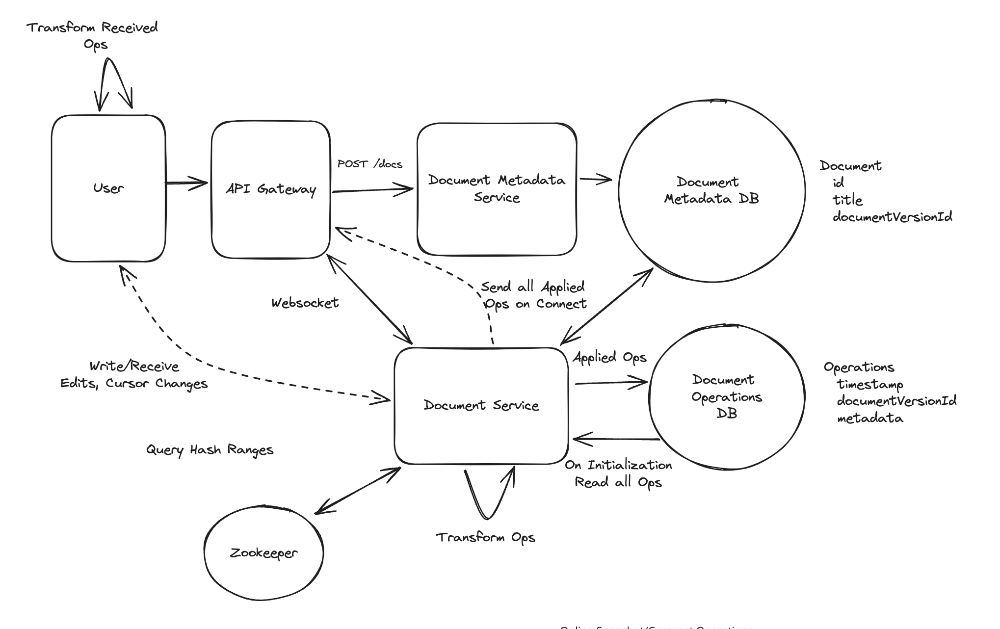

## Main Topics:

- Websockets
- Operational Transformation -> Server and client side
- Zookeeper - consistent hasing
- Snapshot - Operational Transformation compaction

## FR:

- User can create documents and share it
- Multiple users can edit the document concurrently
- Users can view each other edits
- see Cursor Position

## Different Services

- Document Metadata Service -> Document Table
- Document Service -> Document Operations DB
- PostGres SQL DB -> Flexible Query -> scale -> Partition and Replication

## Deep Dives

- Multiple Users should be able to edit the document concurrently

  - Establish a Websocket connection to document service
  - Consistency and Contention Problem
    -> "Hello" -> User A edits ", World"
    -> User B edits delete "!"
  - Operational Transformation (OT)
    - We can transform each edit based on history of how the edits arrived
    - User A edits ", World" (Removed ! -1 and then added 7 words so 6 net new insertions)
    - User B DELETE(6) Transformed to DELETE(12)

- User should be able to view the edits

  - First time loading -> load all of the OTs - since all websockets of the document connect to same server they all receive same OT
  - Client Side OT:
    - When concurrent edits happen (Websocket) -> User B edits needs to be seen real time locally -> Make changes
    - User A changes receive the server first and then User B side pulls the websocket changes instead of naively applying the changes locally for User A transaction we need to then progressively do a OT client side to maintain consistency.

- Cursor position:

  - Store the cursor position in memory - its ephemeral data
  - Websocket broadcast it to all the other servers

- Websocket cannot be scaled to millions of users:

  - Zookeeper to introduce consistent hashing for the document Id
  - when user select the document Id that it needs the zookeeper kicks in and redirects the user to the server that is hosting the websocket or is supposed to for the connection for that document

- Storage Management:
  - When the last user disconnects from the websocket we offload the operations for compaction
  - create a new documentVersionId for the given documentId and save it in document DB
  - change the documentVersionId in the document Meta data database
