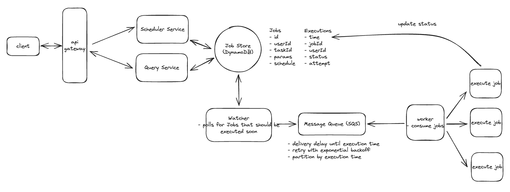

## Main Topics

- CRON Job
- Amazon SQS
- Containers
- Partitioning and GSI
- Invisible Failures

## FR

Automatically schedules and executes jobs at specified times/intervals. Automate repetitive tasks, run scheduled maintainance, execute batch processes.
Task - Work to be done
Job - Instance of a Task with parameters of when

job -> send an email to john@example.com at 10:00 AM Friday -> Task -> Send an email

- Users are able to schedule task to be executed immediately at a future date or recurring schedule
- User should be able to monitor the status of their jobs

## Services

- Scheduler Service
- Query Service
- DyamoDB
- Watcher poll
- Amazon SQS
- worker - Container

## Deep Dives

- General Arch:

  - Schedule Service stores the jobs and execution (Each instance of future jobs) in 2 separate tables
    the table is partitioned by timestamp - this way we only need to query 1-2 partition tables so lookup is easier when the execution service CRON calls to check which job to run
  - For fetching jobs published for a given user:
    - Create a GSI on Executions table with userId and sort key execution_id + job_id

- How can we ensure system executes jobs within 2s of their scheduled time

  - We add a watcher which polls the DB for jobs to be executed in the next 5 mins (It is partitioned by timestamp)
  - we add the jobs to Amazon SQS (Message Queue) and then the worker will then pull jobs from the queue
  - Amazon SQS helps with adding jobs as priority queue
    - for jobs just scheduled and to be ran in under 5 mins we add the job to the message queue directly as well for it to meet the 2second criteria (Otherwise jobs won't run instantaneously)

- System is able to support 10k jobs per second

  - Likely recurring jobs vs creation jobs the ratio is large - but small need to add a queue infront of the scheduler service
  - We can also have a query service and scheduler service
  - DB Dynamo DB - partition key on timestamp AND GSI on userId with sort keys
  - Execution workers can be Containers (Good for long running, steady workloads, performance) or serverless (Less operational overhead autoscales but 2 second precision cold start + not good for long running services)

- Ensure Atleast once execution jobs
  - Visible Failure - Bad code configuration - add try catch block and then retry status and put it back in Amazon SQS
  - Invisible Failure - Worker Dies - Amazon SQS automatically makes the message invisible and deletes on success otherwise makes it visible on failure for another worker to pick up - visibility timeout period within which worker needs to process the message (Make visibility timeout to be 30 seconds and poll changeMessageVisibility API)
  - Idempotence - Make jobs to be designed to be idempotent
