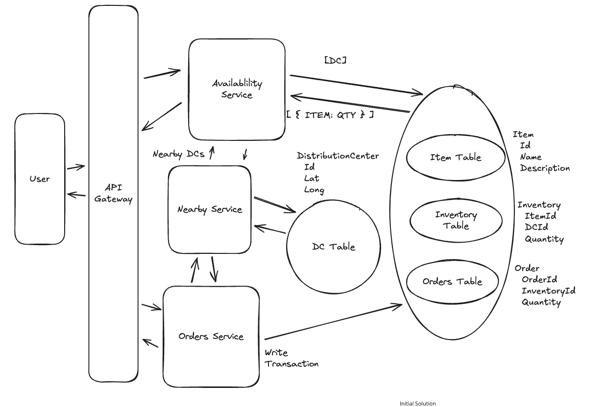

# GoPuff - Local Delivery System

- FR: Query availability of items deliverable in 1 hour by location (All distribution centers available products)

## Customer Should be able to query availability of items Nearby:

- Client provides lat / long
- We have a Nearby Service -> DB with Lat/Long assigned (We should use Elastic Search for faster lookup)
- Availaibility Service -> Separate DataStore for Item/Catalogue and Distribution Center Inventory (Helps Scale Up)

## Customer Should be able to order items:

- Order Service ->
  - Separate DataStore for Orders and DC Inventory - Put a Redis Lock on Inventory item before placing an order if process through the Invetory DB is already removed if fails then the Redis DB TTL puts back the inventory amount inside the order (Good Option but not the best)
  - Have the Tables for DC Inventory and Orders in the same DataStore! (So one DataStore for Catalogue and Another for Inventory AND Orders)
    - SQL Database are Atomic - i.e. if Any part of a transaction fails then the entire transaction fails
    - So client adds item in their cart (Can do some checks in inventory table) -> Then when processing the order we can make a Serializable Transaction to check the inventory and then place the order in one shot - and if the inventory is empty the order is not placed!

## Incoporate Traffic and Drive time:

- Travel Time Estimation Service
- First check the DC Table for the radius (Based on InEfficient distance radius calculator) for available DCs -> Then pass these DCs to the Travel Time Estimation Service for further pruning

## Availability Lookups Fast and Scalable:

- You can put the Inventory for certain objects in a Redis Cache (TTL 1 min) -> Fast + Scalable
- Read Replica and Partitioning of DB
  - Partition different DCs Inventory by DCs Location - Region ID - Leads to all checking of inventory goes to 1 or 2 Partitions - Fast + Scalable
  - Read Replica for Inventory Data store for checking availability

