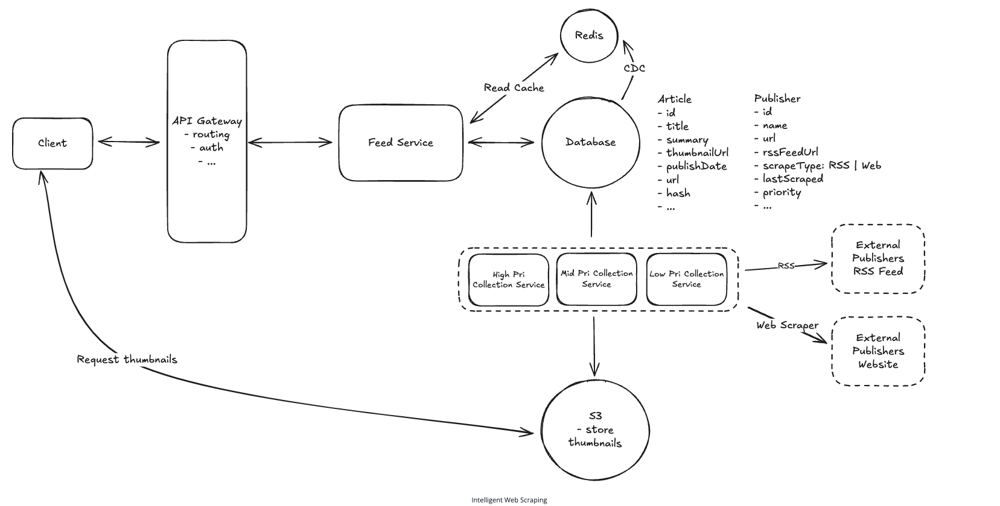

## Main Topics

- Data Collection Service - RSS / Web Scraper / High-mid-low polling / Webhook
- Blob / CDN
- Redis -> Active Passive scaling (Read replica)
  - filtering based on categories

## FR

- User can read news from 1000 different sources
- Users should scroll through the feed inifinitely
- Click on Ads and redirected to the publishers website

## Services

- Data collection Service
- feed service

## Deep Dives

- Collecting News Articles:

  - Data Collection Service
    - fetches RSS feed - XML
    - Web Scraper
    - Webhook for companies to send us the data
    - S3 for storing images on our side - since faster retrievel

- Pagination:

  - timestamp, article Id - Compound key for ordering the request in sorted order
  - OR incremental articleId

- Low Latency:

  - Redis with CDC on the Database

- Fetch news within 30 mins of publication:

  - Above already handles that BUT can also add high, mid, low level polling services
  - Webhook is major

- Media Content:

  - Blob Storage + CDN

- Traffic Spikes during breaking news:

  - Horizontal scale the feed service
  - DB - Redis already supports - scale it Write Read replicas

- Category news feed
  - Right now Region Based so provide that in query param but want to also get category
  - Can I have different combinations OR
    - Just store the category as key value - fetch the region based content and then you can further filter out in memory of the feed service
