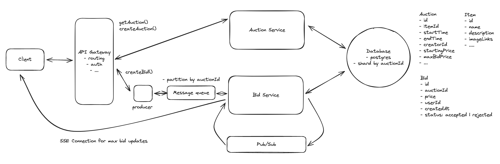

## Main Topics

- ACID bid Table for auction
- MQ - especially for spikes and durability
- SSE + Pub/Sub

## FR

- Users can post products to be auctioned - with starting bid and end date
- Users can bid for products
- Users can view the current auction with the highest bid
  - This proposes that we need to fetch the highest bid value

## Services

- Auction Service
- Bidding Service
- SQL DB (Because consistency of the bids matter)

## Deep Dives

- How can we ensure strong consistency

  - Our auction table for the product also contains the maxBid value within the DB
  - SQL Atomicity enables us to keep the data consistent along with optimistic locking

- Fault tolerance and durable system

  - System cannot loose any bids
  - load spikes towards end of auction
    - Kafka - MQ - maintains order and also saves the bid the moment it lands onto our bid service

- How do we display max bid in real-time

  - SSE - send events whenever the maxbid changes

- Handle 10M concurrent auctions
  - MQ - N/A - Can do partitioning by auctionId
  - Auction/Bid Service - Horizontal scale
  - Database - Shard it by auctionId
  - SSE:
    - Managing connections to say 100 M users at a time is extremely inefficient -
      - we won't be able to maintain that many connections
      - we need to find a way for the servers to communicate with each other to fix this problem
      - Pub/Sub:
        - Each service whenever it receives a new bid - it publishes that bid to the pub/sub system
        - all instances of bid service are subscribed to the pub/sub channel and receive the message
        - if bid service system if one of the clients is subscribed to the auctionId then they send an SSE
