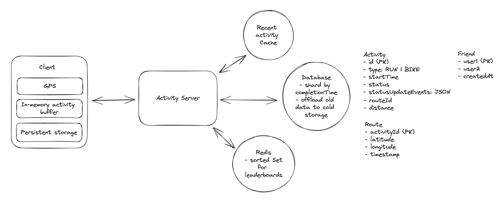

## Main Topics

- Tracking server with polling - sending GPS co-ordinates - calculate using haversine formulae
  - No Pub/Sub - websockets required like WhatsApp
- Save this data Client Side for offline
  - in memory buffer and then local storage
- Redis

## FR

- Users can start, pause, save their runs
- Users can view their activity while running (Even in aread with no network)
- Users can see their friends activity and their own

## Services

- Activity Server

## Deep Dives

- Basic Arch:

  - Create an activity object through the activity server and return it to the client
  - then pause, save could be handled through PATCH requests
  - To measure elapsed time we can measure it through just sending logs of different situations of start and pause and then the complete would be able to remove the elapsed time - START, PAUSE, RESUME, STOPPED

- Users should be able to view their activity

  - use GPS co-ordinates to send the GPS to the server - polling - runs 2s and 5s for bike
  - Use haversine formulae to calculate

- Users should be able to view details about their own activities as well as their friends

  - GET Request to fetch freidns and then the activity

- Users should be able to record their activity offline

  - Client side store activity in memory buffer and then every 10 seconds we store this in the device local storage
  - When activity is resumed we check the device local storage to continue the activity

- 10M Concurrent number of activities:

  - can just horizontal scale - this data is managed on the client side and does not need any type of persistent connection to the server - so different servers could get the data for the same activity
  - can store archival data in the Blob Storage and any recent data in memory for quicker access

- Can view real-time activities of their friends

  - we could do some sort of pub/sub with websockets but over-engineering (Similar to Whatsapp or FB live comments)
  - Can just do basic polling - a few seconds delay of users status is acceptable

- Leaderboards:
  - Essentially everytime a new activity is logged the redis db leaderboard could then calculate the distance in haversine
    - and from there we can sort the activity
    - If we further want to update based on category such as country we can add data based on key - leaderboard:RUN:CAN
