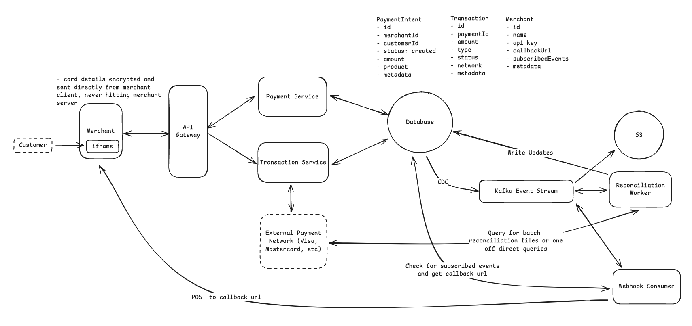

## Main Topics

- Kafka - event stream -> S3 audit log
- Webhook
- Reconciliation worker

## FR

- Merchants should be able to initiate payment
- User should be able to pay for products with credit/debit cards
- Merchants should be able to view status update for payments

## Services

- Payment Intent Service
- Transaction Service
- Kafka event stream
- Reconciliation worker
- Webhook
- S3

## Deep Dives

- Basic Arch:

  - Payment Intent Service - Creates the id, merchantId, customerId, status, amount, product
  - Transaction Service - Receives card details to manage transaction, interacts with external payment system (Visa, mastercard, Amex etc)

- System should be highly secure

  - Merchant making the request - are them
    - API Key - Store in our database associated with merchants account (AuthN or X-API-Key) -> Can be replayed infinite times
    - Request Signing to prevent replay attacks -> above public API Key and private secret keys
      - Generate a hash using the secret key and body, endpoint, params AND timestamp
      - Generate a hash using the secret key for nonce
      - We can recreate the HMAC signature and use nonce to see if it ever was called
  - Protecting sensitive customer data
    - Javascript SDK iframe control - We encrypt the data using public key instantly when the user enters
    - Decrypt the data using private key

- The system should guarantee durability & auditability with no transaction data ever being lost, even in case of failures

  - We need to change status of intent of payment but also maintain history
  - CDC on the DB for any status change operation the CDC writes the data to the event stream like kafka
  - Gives audit log and kafka provides replication for durability

- The system should guarantee transaction safety and financial integrity despite the inherently asynchronous nature of external payment network

  - There can be timeouts on the vendor payment network service - We need to retry our calls to payment networks
  - We use our event stream
    - Before calling any payment network we write an attempt record to our db (Network name, referenceId, and what we are doing) -> This triggers a CDC
    - Call the payment network with the charge requestId -> update the response (success, timeout, actual failure)
    - Reconciliation service consumers the timeout from the event stream pro-actively queries the payment network with out recorded reference ID

- The system should be scalable

  - Servers are stateless -> Horizontal
  - Kafka - Parition by paymentIntentId and replication
  - DB - we can shard/partition the DB (10k rps - well optimized)

- How can we expand the design to support webhooks
  - Merchants provide us with a callback URL and the subscribed events they're subscribed to
  - Webhook consumes from the same kafka stream -> webhook checks the callback URL for the given event_type
