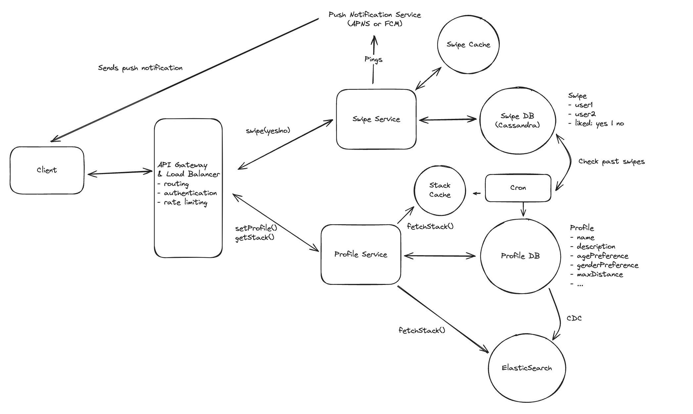

# Main Topics

- Profile and matching service - 2 DBs + 1 elastic search
- Cassandra for high write
- DB Transactions
- Redis + CRON Job
- client side caching

# FR

- User should be able to create their profile with preferences - Age, ... and max location
- User should be able to see matches based on filters i.e. Age, location
- User should not see profiles that they previously not liked
- Use can express yes or no by swiping
- User get matches notification if mutual likes

# Services

- Profile service - Create and fetch stack of potential candidates
- Matching Service

# Deep Dives

- Alot of data for matches especially Write

  - Tackle this with storing User A and User B matches in Cassandra since it handles high writes
  - Can't use Redis since in memory and this is going to be a massive data set
  - Partition on swiping_user_id

- How can we ensure swiping is consistent and low latency

  - Concurrent swipe rights
  - There needs to be some level of consistency:
    - DB Transactions -> Swipe and reciprocal swipe check are done in the same transaction

- Low latency for feed/stack generation

  - Indexing the Profile DB based on common preferences like location, age etc using Elastic Search
  - Adding a CRON job with cache storage to setup stack of likely profiles

- Prevent showing profiles user has previously swiped on
  - CRON Job can check swipe DB for past swipes and we can add a client side cache too
