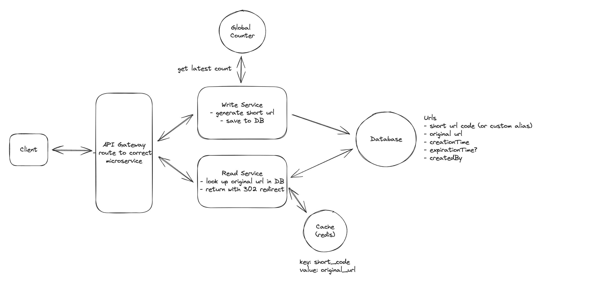

## Main Topics

- Base62 encoding
- hash function
- Global Counter
- 302 redirect

## FR

- Able to click on URL and be redirected to another URL

## Services

- Read Service
- Write Service

## Deep Dive

- Read Service has a cache
- DB original and shortenURL
- CDN
- Global counter w/t Base62 encoding OR Random Number Generator with hash function and hashmap
