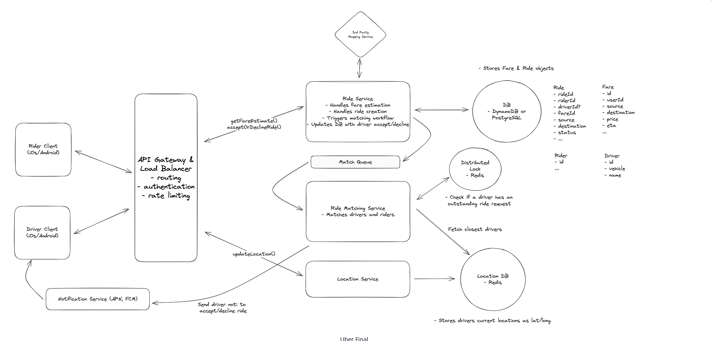

# Uber

# Main Topics:

- Polling for Location Update
- Redis for managing polling high writes
- Adaptive Location update
- Redis Lock
- Temporal / AWS Steps function
- Geosharding partitioning geographically

## FR:

- User can enter their location and get a estimate of cost
  - Lat/Long would be provided -> Then we have a fare calculator algorithm that based on distance calculates the fare
- User can request rides from nearby riders (Nearby - Drivers need to send location)
  - Driver would need to open the app and then poll their location/latitude - every 5 seconds
  - We would need elastic search for lat/long polling data that can find the radius of available drivers
- accept rides notification

## Different Services:

- Fare Estimate Service
- Location Update Service
- Finding Driver Service
- Notification Service that finding driver service triggers -> Apple Push Notification and FireBase Cloud Messaging

## Deep Dives:

- High Frequency of Writes -> 10 M drivers every 5 seconds => 2M per second AND efficient proximity searches

  - We could use Elastic Search or PostGIS for proximity and batch the writes of location to the DB (Real time updates no longer)
  - Alternative, Use Redis
    - In memory so faster can take up high volume
    - Has GEOADD and GEOSEARCH -> converts lat/long into a hash string and indexed using sorted set - efficient querying of geospatial data AND GEOSEARCH which helps with querying nearby location
    - TTL expires data

- High Overload of location update from 10M drivers

  - Adaptive Location update intervals

- Multiple ride requests to the same driver

  - Use Redis Distributed Lock
  - When we trigger the Finding Driver Service to book the driver thats closest we can add a lock on the driver Id

- No Requests are dropped during peak demand periods

  - Queues - Between ride service (get estimate) and Ride Matching Service
  - Can partiion the ride service + queue based on geolocation and scale
  - since between Ride Service and Matching Service -> If Matching Service goes down new instance can pick up the queue

- Driver fails to respond in timely manner

  - AWS Steps Function or Temporal
  - Execution Workflow you can setup

- Further Scaling of the system reduce latency and improve throughput
  - GeoSharding partitioning **geogrpahically** of Ride Service, Ride Matching Service, Queue, Location Service, the DB
  - Helps throughput since partitioned but latency too since close to the user
