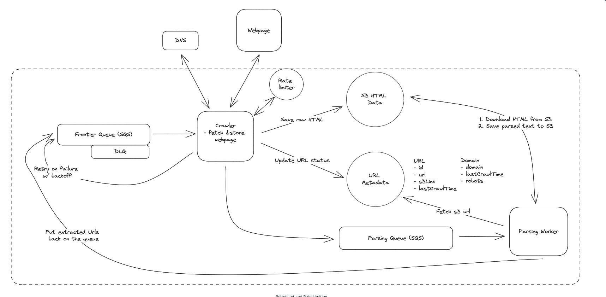

# Main Topics

# FR

- Crawl web pages and go from one link to another on the web pages (Start from seed URLs)
- Extract Text data and store the text for later processing

# Services

- Web Crawler - Extract URL, domain, HTML
- Parser - Text and Associated Links
- 2 Queues

# Deep Dive

- General way:

  - Queue with Seed URLs
  - WebCrawler Service -> Goes to DNS for IP lookup and then extracts Text and other URL links on the website
  - Stores text into S3 and stores the further down URLs to Queue

- Ensure Fault Tolerance:

  - We can separate out the Text Extraction into another service
  - Have Crawler only fetch IP Address and save the Raw HTML in S3 dB and actual URL in metadata dynamo storage (with s3 link)
    - Have this Crawler further add the URL to another queue
  - Parser service gets the URL to be parsed - fetches S3 URL from Dynamo and then does the extraction of the textual data feeds back to S3 and then progressive URLs are stored back to the first Queue

- Fail to fetch URL

  - Queues support retry logic
  - visibility timeout - exponential to capped to 15 minutes - 30 -> 1 -> 2 -> 5 -> 10 -> 15 min

- Crawler goes down:

  - Queues visibility timeout automatically becomes visible if ack not sent back from crawler

- Ensure Politeness and robots.txt:

  - Robots:
    - Crawl-Delay - 10 seconds - Add Domain and last time crawled timestamp for the domain in dynamoDB - if crawl delay time is not passed put the URL back into the first Queue
  - Rate Limiting:
    - If multiple replications can cause issues for 1 rps limit
    - Redis to store request count per second - the crawlers need to check redis to see if they haven't exceeded it

- 10 B Pages scaling and efficiency:
  - replication of the crawl server and the parse worker
  - DNS caching of the same URLs to IP config
  - Some domains have the same exact content -> can just hash the HTML and index based of the hash
    - lookup the hash of the HTML we just extracted if exist in metadata don't provide it to the 2nd queue
