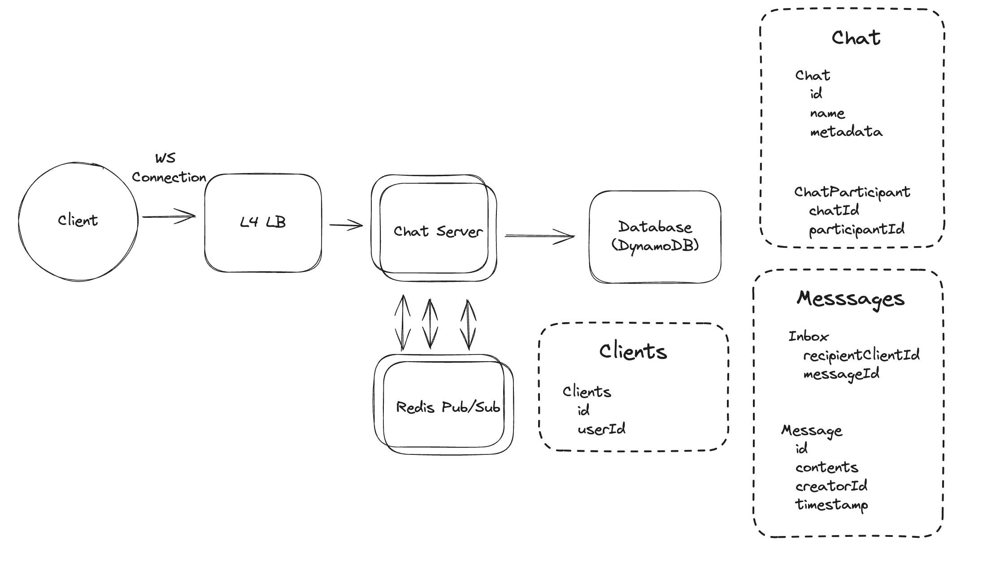

# Main Topics

- Websocket connection
- Pub/Sub -> Multiple chat server talking to each other
- Inbox table for undelivered message per client device basis

# FR

- Users can create group chats <= 100
- Users can send/receive messages to 1 or more users
- Users should be able to send/receive media
- Offline message receiving

# Services

- Chat Server
- DB - Chat server information, its participants AND Messages Inbox of undelivered messages and Message table for all messages

# Deep Dives

- General Establish a Websocket connection -> Chat server -> Dynamo DB (High R/W)

  - Since Websocket connection not all users will be connected will store undelivered messages in inbox
  - Upon receiving the messages the client will send an ack message - then delete message from inbox
  - Manage Media/Attachment using Blob Storage

- Billions of simultaneous users

  - Managing that many websockets on a single host system is not possible
  - If we add more chat servers then each chat participant needs to be on that server and if that participant is on another server that convolutes the scenario
  - We can do some form of consistent hashing where userId has chat server listed and then look up the chat registry and send the message to it -> This also leads to that each chat server would need to talk to each other
  - Best:
    - We are sending messages between servers -> Use Pub/Sub model
    - Create a subscription for userId for a given group chat
    - Chat server will connect to pub/sub to subscribe to the topics of the user who just logged into that chat server
    - any messages received on the subscription topic are forwarded to the websocket connection
    - If clients are not connected they will receive all the undelivered messages when they log in based on inbox above

- Multiple devices for a single user
  - Clients table for the user devices
  - look up participants for chat also lookup clients
  - inbox will also store data per client basis - so when user logs in that chat is still saved
  - Pub/Sub unaffected
