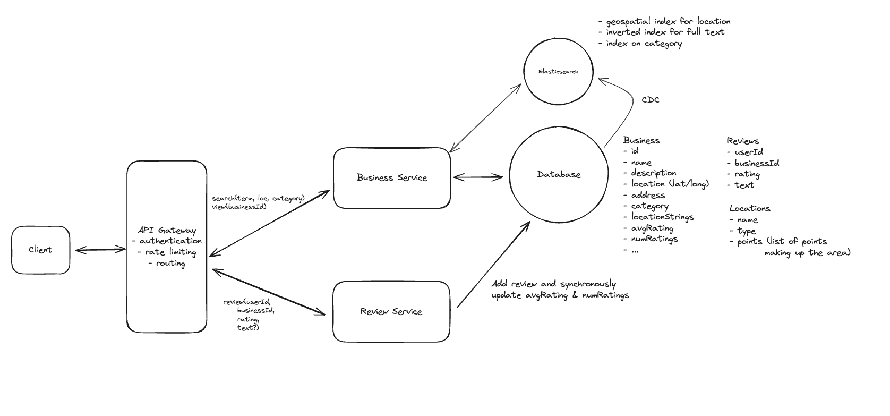

## Main Topics

- Elastic Search
- ACID Transaction - for leaving reviewing and calc average
- GeoShape / Geoapify / Precomputation - filtering based on loose terms

## FR

- User can view restaurants -> And their reviews
- User can leave review of restaurants -> (1-5 start rating and optional text)
- User can search for restaurants nearby -> loc/lon, name, category

## Services

- Review Service
- Business Service

## Deep Dives

- General Arch:

  - Review Service to send reviews
  - Business Service to view and edit reviews on
  - Business and Review Table

- Efficient calculation of when new reviews are added:

  - on business table update the average rating when a new review is added on Transaction - have total # of reviews on the table

- Leave one review per business

  - DB Constraint when adding to reviews table to check businessId and userId

- How can you improve search to handle complex queries more efficiently

  - CDC on Elastic Search
  - Location - Geohashes indexing
  - name - inverted index (Search for terms in a document)
  - Category - B-Tree Index

- Search by predefined location names such as cities and neighbourhoods
  - Search Pizza in Toronto or Pizza in Queen
  - Convert the location into a polygon (arbitrary radius) and then filter business that exist within the polygon
    - Location to polygon:
      - map streets to polygons (Represented in GeoJSON) -> Geoapify is a good resource for fetching this data
        we store this in our new location table
  - Polygon to filter the business:
    - GeoShapes in Elasticsearch - find business exist within a polygon
    - We can add geoshapes to our elastic search document
    - Use geoshape query to find businesses that exist within a polygon
      - instead of every search doing filtering would be inefficient
      - We rather just pre-compute the aread for each business uppon creation and store them as a list of location identifiers in our business table
