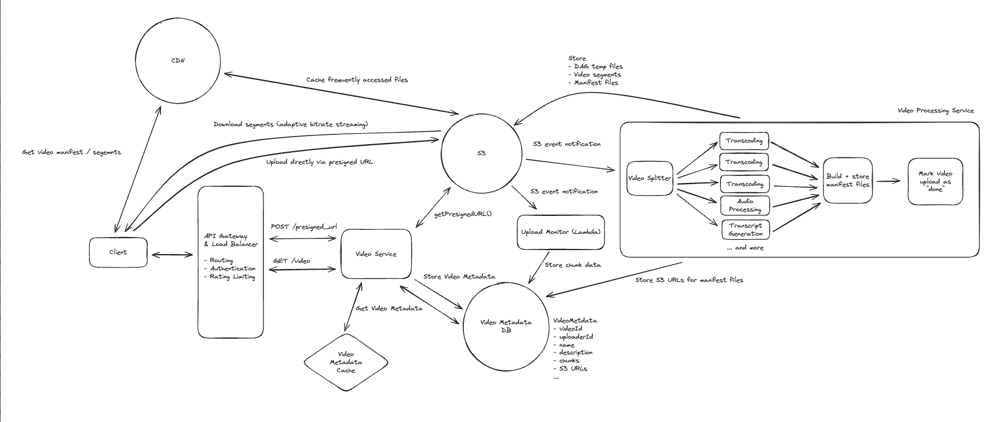

## Main Topics

- s3 Multi-part upload
- Processing videos
  - segment files into different format
  - store the files in manifest file -> Primary metadata, media - links to segment

## FR

- Users can upload videos
- Users can watch (Stream) videos
- 10s of GB of data

## Services

## Deep Dives

Background:

- Video Codec - Compression / decompression
- Video Container - file format stores video data and metadata, houses transcripts as well
- Bitrate - # of bits transmitted over a period of time (kbps / mbps)
- manifest files - details about the video

  - primary - all version of video
  - media - links to clip files

- Basic Arch

  - Upload:
    - Store the files in s3 - directly multi-part upload
    - video processing service kicks off and segments the videos into smaller clips and stores the different format of clips into s3 (Also update with the location of the manifest file which contain videoMetadata)
  - Download:
    - Adaptive Bitrate Streaming
    - Get Manifest file link - then based on network download first few clips then do the same logic again

- How can we handle processing video to support adaptive bitrate Streaming

  - Output:
    - Video Segment Files - in different format
    - Manifest files (Primary + Media) -> Media files have links to Video Segment Files
  - Order:
    - Split file into segments (using ffmpeg)
    - Transcoded segments into different formats (Create other aspects of segments - audio, transcripts) -> Generate video containers
    - manifest files - reference different segments in different video formats
    - Mark upload as complete
      -> One Way dependencies, with fan-out, fan-in -> DAG of work -> Can use Temporal to fix this

- How can we support resumable uploads

  - Split file into chunks (5 - 10MB) -> Each having fingerprint hash
  - VideoMetadata - field called chinks - with list of JSONs - each with fingerprint and status
  - client upload each chunk and then s3 take the hash and update videoMetadata of the chunk with uploaded
  - When client comes back we pull the videoMetadata view which fingerprint is uploaded and not send those

- Scale large number of videos uploaded/watched
  - Video Service - horizontally
  - Video Metadata - Cassandra - Consistent Hashing + high write horizontally scale:
    - Hot Videos - Cache + replicate data to few other nodes in Cassandra
  - video processing service - internal queue is already there, can handle large amount of traffic - worker nodes may need to be scaled
  - s3 - high traffic good
    - far away - Introduce CDN - cache popular videos (Segment + Media) - near user location
  - IF upload faster:
    - Assumed client will upload entirety of video
    - Segment the videos on client and then the backend can immediately process the segment when it receives it
